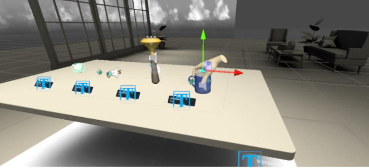
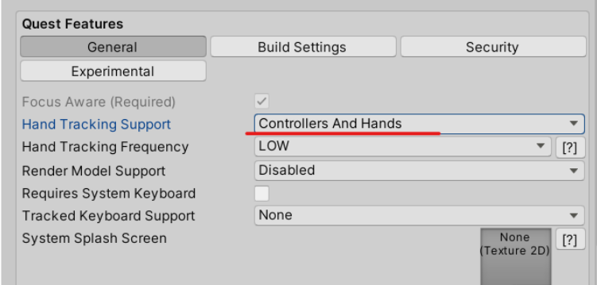
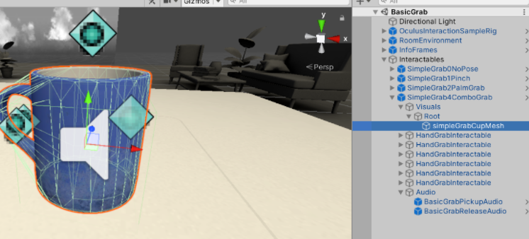

#　プロジェクト用意

Interaction SDK Overview

https://developer.oculus.com/documentation/unity/unity-isdk-interaction-sdk-overview/?locale=ja_JP

Oculus Integration for Unity - v37以降をアセットストアから取得したのち、もしくは取得済みの場合はUnityのPackage Managerからv37を取得、インポートを行う。
- 途中でbackendをOpen XRに移行するか聞かれるが現時点ではキャンセルでアップデートしない
- URPのプロジェクトの場合、サンプルシーンなどで使用されているマテリアルは無効な表示（ピンクマテリアル）となってしまう

# サンプルシーン
Assets/Oculus/Interaction/Samples/Scenes/BasicGrab.unity

４つあるオブジェクトをハンドトラッキングやコントローラで握る制御。  
それぞれ握りかたにより手モデルのアタッチの際の手モデル形状の合わせかたが異なる様子が分かる.

### Questビルド時の注意点。
Androidプラットフォームにしてビルドを行うとQuestにインストールして確認することが可能.  
その際、ハンドトラッキングの動作を確認したい場合には、OVRCameraRigコンポーネントの[Quest Features] - [Hand Tracking Support] がデフォルトで”Contorollers Only”になっているので、”Controllers And Hands”に変更する。

## オブジェクト構成

一番右に配置されているマグカップオブジェクトで動作を見ていくこととする.  
[Interactables] - [SimpleGrab4ComboGrab]

SimpleGrab4ComboGrabオブジェクトのコンポーネント
- Transform
- Rigidbody
- Transformable
- Interactable Unity Event Wrapper
- Transformable Unity Event Wrapper
- Hand Pose Recordable

SimpleGrab4ComboGrabオブジェクトの子オブジェクト
- Visuals -> 表示されるメッシュなどをさらに子オブジェクトとして持つ
- HandGrabInteractable -> Grab設定マグを横から持つ場合の設定（右手用）
- HandGrabInteractable -> Grab設定マグを上から手を被せるように持つ場合の設定（右手用）
- HandGrabInteractable -> Grab設定マグを上から手を被せるように持つ場合の設定（右手用）
- HandGrabInteractable -> Grab設定マグを横から持つ場合の設定（左手用）
- HandGrabInteractable -> Grab設定マグを上から手を被せるように持つ場合の設定（左手用）
- HandGrabInteractable -> Grab設定マグを上から手を被せるように持つ場合の設定（左手用）
- Audio　-> Grab時のサウンド

６つのHandGrabInteractableが左右３つの持ち方の制御に相当している。

##　コンポーネント

### Oculus.Interaction.Transformableコンポーネント
概要  
> Handles a list of IPointables and converts their events into transform
> changes on the GameObject this Transformable is attached to.  
(訳)IPointablesのリストを扱い、それらから発生されるイベントをこのTarnsfomableがアタッチされているゲームオブジェクトのtransformへの変更に変換します。

