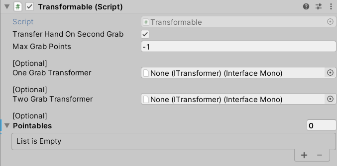
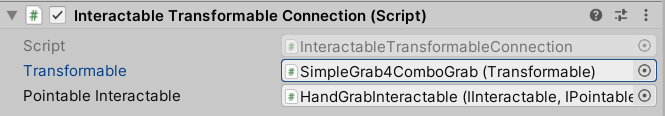
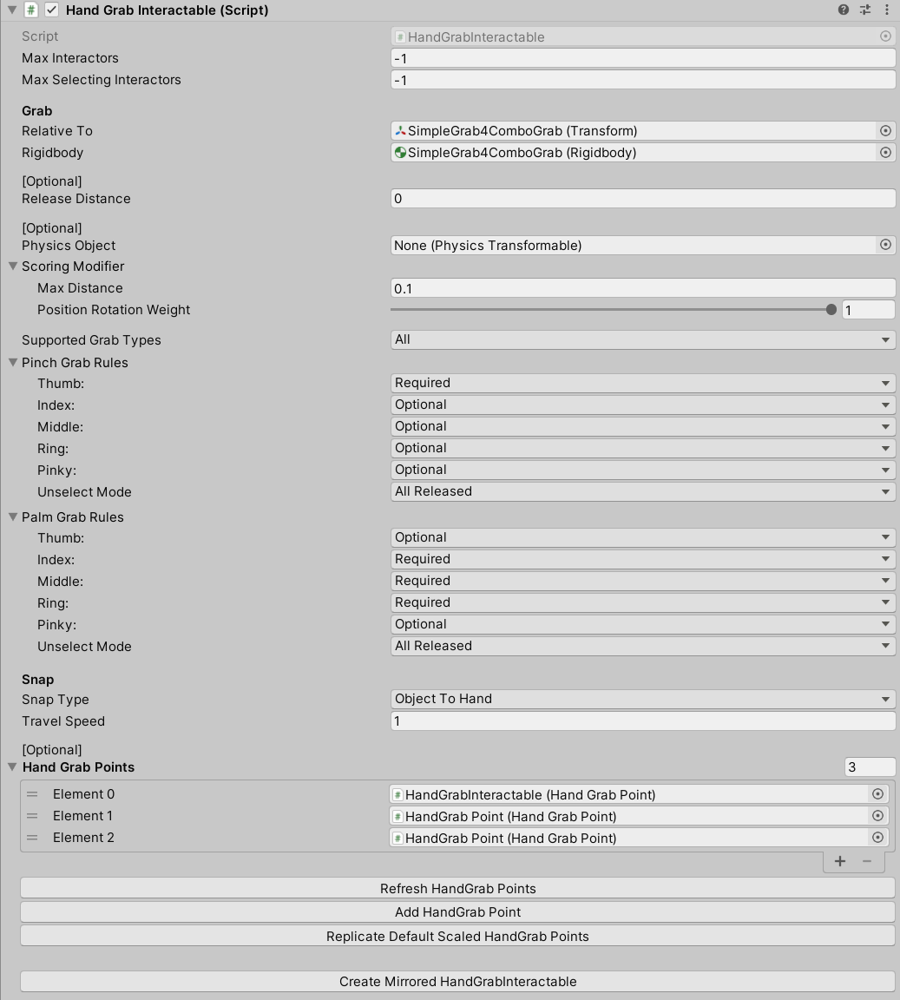
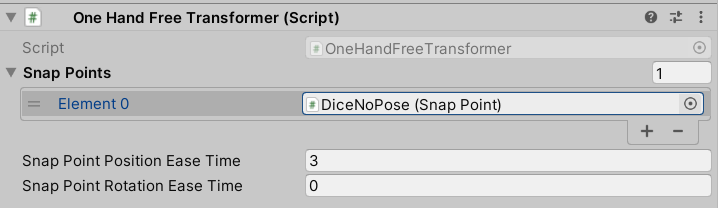
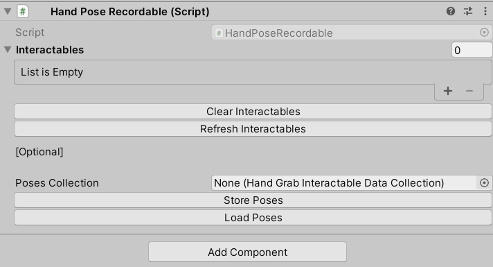
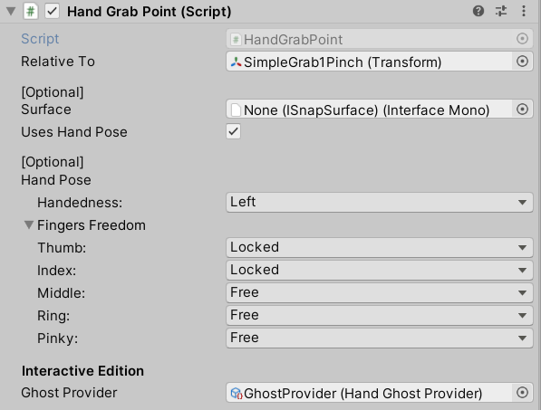
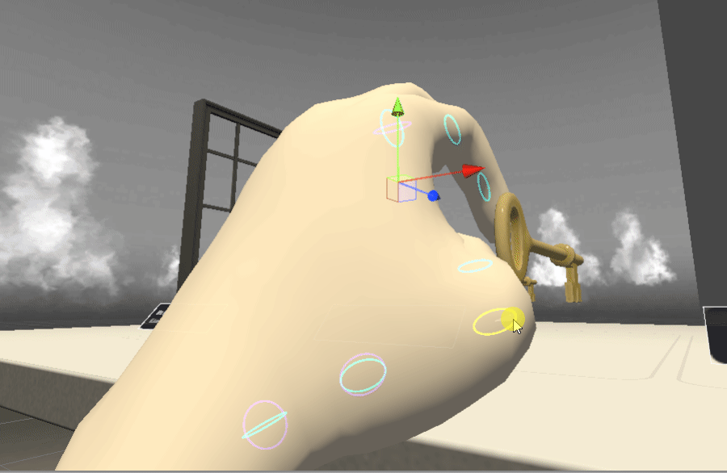

#　プロジェクト用意

Interaction SDK Overview

https://developer.oculus.com/documentation/unity/unity-isdk-interaction-sdk-overview/?locale=ja_JP

Oculus Integration for Unity - v37以降をアセットストアから取得したのち、もしくは取得済みの場合はUnityのPackage Managerからv37を取得、インポートを行う。
- 途中でbackendをOpen XRに移行するか聞かれるが現時点ではキャンセルでアップデートしない
- URPのプロジェクトの場合、サンプルシーンなどで使用されているマテリアルは無効な表示（ピンクマテリアル）となってしまう

# サンプルシーン
Assets/Oculus/Interaction/Samples/Scenes/BasicGrab.unity

４つあるオブジェクトをハンドトラッキングやコントローラで握る制御。  
それぞれ握りかたにより手モデルのアタッチの際の手モデル形状の合わせかたが異なる様子が分かる.

### Questビルド時の注意点。
Androidプラットフォームにしてビルドを行うとQuestにインストールして確認することが可能.  
その際、ハンドトラッキングの動作を確認したい場合には、OVRCameraRigコンポーネントの[Quest Features] - [Hand Tracking Support] がデフォルトで”Contorollers Only”になっているので、”Controllers And Hands”に変更する。

## オブジェクト構成

一番右に配置されているマグカップオブジェクトで動作を見ていくこととする.  
[Interactables] - [SimpleGrab4ComboGrab]

SimpleGrab4ComboGrabオブジェクトのコンポーネント
- Transform
- Rigidbody
- Transformable
- Interactable Unity Event Wrapper
- Transformable Unity Event Wrapper
- Hand Pose Recordable

SimpleGrab4ComboGrabオブジェクトの子オブジェクト
- Visuals -> 表示されるメッシュなどをさらに子オブジェクトとして持つ
- HandGrabInteractable -> Grab設定マグを横から持つ場合の設定（右手用）
- HandGrabInteractable -> Grab設定マグを上から手を被せるように持つ場合の設定（右手用）
- HandGrabInteractable -> Grab設定マグを上から手を被せるように持つ場合の設定（右手用）
- HandGrabInteractable -> Grab設定マグを横から持つ場合の設定（左手用）
- HandGrabInteractable -> Grab設定マグを上から手を被せるように持つ場合の設定（左手用）
- HandGrabInteractable -> Grab設定マグを上から手を被せるように持つ場合の設定（左手用）
- Audio　-> Grab時のサウンド

６つのHandGrabInteractableが左右３つの持ち方の制御に相当している。

##　コンポーネント

### Oculus.Interaction.Transformableコンポーネント

SimpleGrab4ComboGrabオブジェクト

概要  
> Handles a list of IPointables and converts their events into transform
> changes on the GameObject this Transformable is attached to.  
(訳)IPointablesのリストを扱い、それらから発生されるイベントをこのTarnsfomableがアタッチされているゲームオブジェクトのtransformへの変更に変換します。

Transfar Hands On Second Grab  
別の手によるグラブにオブジェクトが掴まれることを許容するフラグ

### Oculus.Interaction.InteractableTransformableConnectionコンポーネント

HandGrabInteractableオブジェクト  
各持ち手設定

マグカップと各HandGrabInteractableオブジェクト(IInteractable, IPointable)を仲介するコンポーネント.  
アクティブ時にマグカップ側のTransformableコンポーネントのAddPointableを呼出し、子のHandGrabInteractableオブジェクト（コンポーネント）を関連づける.  

### Oculus.Interaction.HandPosing.HandGrabInteractableコンポーネント

    public class HandGrabInteractable : Interactable<HandGrabInteractor, HandGrabInteractable>,
        IPointable, ISnappable, IRigidbodyRef, IHandGrabInteractable
        
        

    /// 

    /// A HandGrabInteractable indicates the properties about how a hand can snap to an object.
    /// The most important is the position/rotation and finger rotations for the hand,
    /// but it can also contain extra information like a valid holding surface (instead of just
    /// a single point) or a visual representation (using a hand-ghost)
    /// 

 HandGrabInteractableはどのように手がオブジェクトにスナップするのかを示すプロパティを持ちます.  
 位置・回転と指の角度を設定できるとういう重要な位置にあります.  
 ほかにも有効なホールド時のサーフェス（ひとつの点の代わりに）やハンドゴーストを用いた見た目の表示の役割を担います.  
 
 

Max Interactors
Max Selecting Interactors

Relative To
Rigidbody
Release Distance

Physics Object
ScoringModifier
Max Distance
Position Rotation Weight

Supported GrabTypes
        None = 0,
        Pinch = 1 << 0,
        Palm = 1 << 1,
        All = (1 << 2) - 1
        
Pinch Grab Rules　つまむ場合のルール
Thumb, Index, Middle, Ring, Pinkey  それぞれの指が必須かオプショナルか選択可能
Unselected mode 

    public enum FingerUnselectMode
    {
        AllReleased,
        AnyReleased
    }
    
 Palm Grab Rules てのひらで握る場合のルール

Snap 

    public enum SnapType
    {
        /// 

        /// Move the object towards the hand after the user starts a grab
        /// 

        ObjectToHand,
        /// 

        /// Move the hand towards the object and stay
        /// 

        HandToObject,
        /// 

        /// Move the hand towards the object and return to the original position
        /// 

        HandToObjectAndReturn,
        /// 

        /// Keeps both object and hand at the same distance while grabbed
        /// 

        None
    }
    
 Travel Speed
 
 Hand Grab Points
 握ったときの手の制御

## HandGrab　クラス
グラブ判定のための計算処理が記述されているstaticクラス

        public static bool ComputeShouldSelect(IHandGrabInteractor interactor,
            IHandGrabInteractable interactable, out GrabTypeFlags selectingGrabTypes)
手の側(HandGrabInteractor)が掴まれる側と接触したさい、対象となるか計算を行う.  

        public static float ComputeHoverStrength(IHandGrabInteractor interactor,
            IHandGrabInteractable interactable, out GrabTypeFlags hoveringGrabTypes)
        
手の側(interactor)にたいし、掴まれる側(interactable)の接触度合いの強さを返す.  

## HandGrabInteractorクラス

        protected virtual void ComputeBestSnapAddress(ref SnapAddress snapAddress)
        {
HandGrabクラスの計算を呼出し、対象となるinteractableの中でどれがベストか決定する

判断のためのStrengthはHandGrabAPI.GetHandStrength()で求められる.  
指ごとにさらに強さをもとめ、
FingerReqauirementが無視でなく、オプショナル(Optional)と必須(Required)それぞれの最大値を求める.  
指のstrengthはIFingerAPI.GetFingerGrabStreangth(HandFinger finger)
実装としてはFingerGrabAPI.
            public void UpdateGrabStrength(Vector3 poseVolumeCenter)
にて、GrabStreangthを更新している

# サンプルオブジェクト

## SimpleGrab0NoPose  
グラブの際のポーズの指定が存在しせず、手モデルの制御はそのままで動作する.
HandGrabInteractable以下にHandGrabPointが存在しない.   

### OneHandFreeTransformer クラス
ITransformerインターフェースの実装  
Snap Points  
SnapPointのリスト  

SnapPointPositionEaseTime  
SnapPointRotationEaseTime  
グラブ時のSnapPointの位置・回転に合わせる際に補間時間

    /// A Transformer that moves the target in a 1-1 fashion with the GrabPoint.
    /// Updates transform the target in such a way as to maintain the target's
    /// local positional and rotational offsets from the GrabPoint.
    
    /// GrabPointを使用してターゲットを1-1の方法で移動するトランスフォーマー。
    /// 更新は、ターゲットのを維持するような方法でターゲットを変換します
    /// GrabPointからのローカルの位置および回転オフセット。
    
 
    public interface ITransformer
    {
        //初期化
        void Initialize(ITransformable transformable);
        // TransformerによるTransformableの移動開始　⇒　グラブ開始時に呼ばれる
        void BeginTransform();
        // TransformerによるTransformableの移動実行　⇒　グラブ中に呼ばれる
        void UpdateTransform();
        // TransformerによるTransformableの移動終了　⇒　グラブ終了時（離したとき）に呼ばれる
        void EndTransform();
    }
    
### SnapPoint クラス

コライダーや閾値フィールドを持つTransformerへそれら情報を提供する仲介クラス

## SimpleGrab1Pinch  
左右のpinch操作（つまむ動き）に対応。手モデル姿勢制御を行いつまむ形になる.
HandGrabInteractableオブジェクトと、その子にHandGrabPointコンポーネントを持つ.  
SnapPointコンポーネントは持たず、事前にアタッチされたOneHandFreeTransformerコンポーネントも無い（実行時に追加される. SimpleGrab0NoPoseオブジェクトの場合は事前にTransformableに関連付けたTransformerとして設定する必要があり、事前にコンポーネントが追加される）

### HandPoseRecordable クラス

"Clear Interactables"ボタン  
子のHandGrabInteractableオブジェクトを削除する
"Refresh Interactables"ボタン  
子階層のHandGrabInteractableオブジェクトをリストに追加する  
"Store Poses"  
HandGrabInteractableのデータをScriptable Objectに保存する.  
"Load Poses"  
逆にScriptable Objectから読み込む.  

### HandGrabInteractableEditor クラス
HandGrabInteractable用エディタクラス
"Refresh HandGrab Points"ボタン  
自身と子以下のHandGrabクラスをリストに登録し直す.  
"Add HandGrab Point"ボタン  
新規にHandGrabコンポーネントを持つゲームオブジェクトを子に追加する.  
"Replicate Default Scaled HandGrab Points"ボタン  
新規にHandGrabコンポーネントを持つゲームオブジェクトを２つそれぞれ0.8スケールされたもの1.2スケールされたものを追加する.  
"Create Mirrored HandGrabInteractable"ボタン  
自身のゲームオブジェクトのポーズを反転させたHandGrabInteractableを生成する.  

サンプルでは一つのポーズ（HandGrabInteractable以下の１セット）に対し、HandGrabが３つずつ(HandGrabInteractableオブジェクトに１つ、子に２つ）用意しているが、
子の２つのHandGrabオブジェクトを削除しても動作はする模様.  
おそらく手の大きさ違いに対してフォローできるように３つずつ用意しているかと思われる.  

### HandGrabPoint クラス

Surface  
ISnapSurface 追従させるサーフェス(Cylinder Surface等)  
このフィールドにISnapSurfaceが設定されている場合、コンポーネントのインスペクタに"Edit Fingers"ボタン もしくは"Follow Surface"ボタンが表示され、サーフェスに追従するモードか
指ポーズを編集するモードかがトグルで切り替わるようになる。
ISnapSurfaceが設定されていない場合は、常にEdit Fingersのモードとなっており、シーンビュー上で指ジョインとの角度を調整してポーズを編集できる。
Follow Surface状態の場合には対象のサーフェスに合わせ、シーンビュー上でマウスの移動にあわせて手モデルが回転する様子が確認できる.  

指の調整

シーンビューでHandGrabPointコンポーネントを持つゲームオブジェクトを選択し、SnapSurfaceが無いか、"Edit Fingers"を選択した状態であれば
シーンビュー上で指の角度を調整してグラブのさいのポーズを編集できる.  
ポーズは個別のHandGrabPointごとに保存される.  

スナップサーフェス

Assets/Oculus/Interaction/Runtime/Scripts/HandPosing/SnapSurfaces/
以下に
- BoxSurface.cs
- ColliderSurface.cs
- CylinderSurface.cs
- SphereSurface.cs
などISnapSurfaceの各種基本実装が用意されている.  

SphereSurfaceコンポーネントをHandGrabPointと同じゲームオブジェクトに設定し、位置を調整した例.

球の表面にそってグラブ時のスナップ位置が適応される。